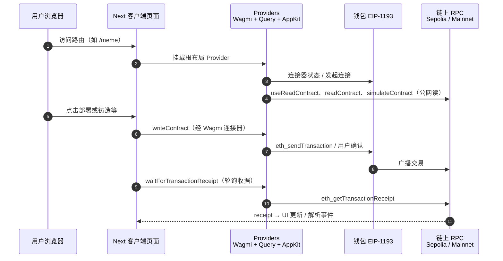
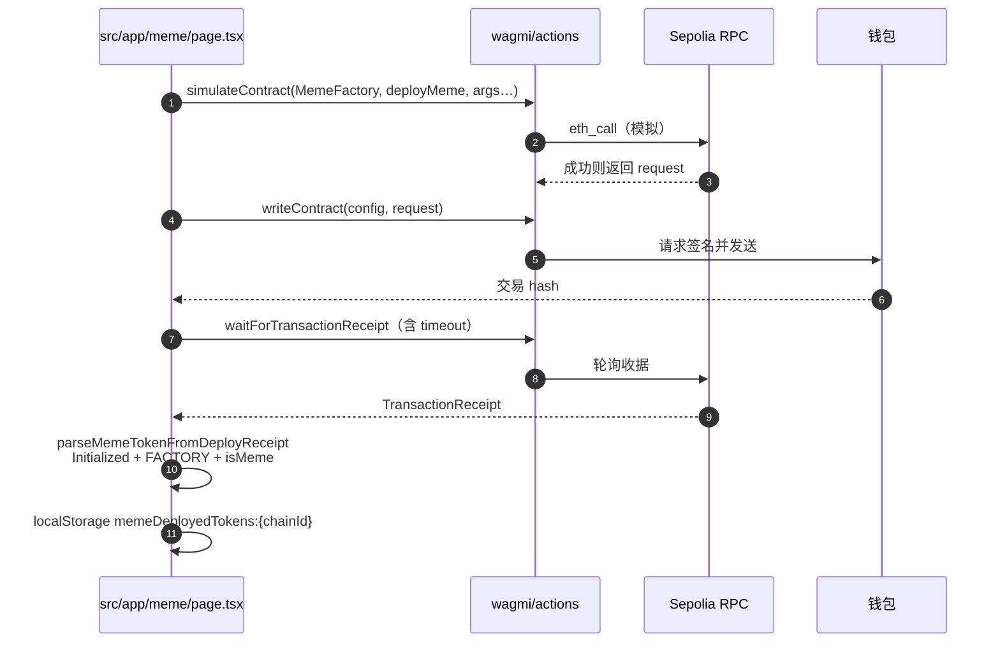
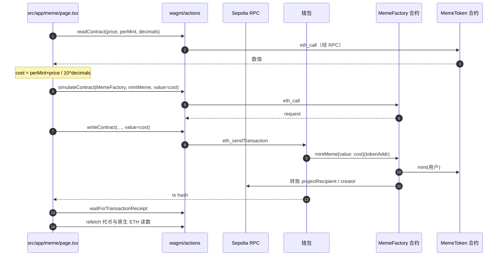

# TokenBank DApp

基于 **Next.js**、**Wagmi**、**Viem** 与 **Reown AppKit** 构建的多模块 Web3 前端：TokenBank 存取、Sepolia **Meme 工厂**、NFT 市场、ERC20 钱包视图等。

## 技术栈

- **Next.js 16** — React 全栈框架  
- **Viem** — 以太坊 TypeScript 接口（编码交易、解码日志）  
- **Wagmi 3** — React Hooks 与 `wagmi/actions`（`readContract`、`simulateContract`、`writeContract`）  
- **@reown/appkit** — 统一连接钱包（与 Wagmi 共用 `WagmiProvider`）  
- **TanStack Query** — 请求缓存与自动刷新  

## 功能概览

| 路由 | 说明 |
|------|------|
| `/tokenbank` | MyToken(V2) 存入/取出、授权、Permit、总存款与人数 |
| `/meme` | **Sepolia** 上 `MemeFactory.deployMeme` / `mintMeme`、本地列表、`parseMemeTokenFromDeployReceipt` |
| `/nftmarket` | NFT 上架、购买、Permit 买法、事件监听 |
| `/erc20wallet` | 索引代币余额与后端转账记录（JWT） |

## 整体调用时序图

下图概括：浏览器如何经 Next 客户端、全局 Provider 与 **Sepolia RPC**、**钱包** 交互。



### Meme：部署 `deployMeme`

前端使用 **`simulateContract` → `writeContract`**，确认后等待收据，再从日志解析新 MemeToken 地址并写入 `localStorage`（按 `chainId` 隔离）。



### Meme：铸造 `mintMeme`

应付 **ETH** 与链上工厂一致：`msg.value = (perMint × price) / 10**decimals`。先 **并行 `readContract`** 取三字段，再模拟、发送。



## 合约与配置摘要

- **TokenBank**（示例，以 `src/contracts/tokenbank.ts` 为准）: `0xBB5Dce153B4bF0b0106b47A93957f55e3fC28d41`  
- **MemeFactory（Sepolia）**（`src/contracts/meme.ts`）: `0xe59a723aB198aF185c970957386faf4e27cBAd63`  

Meme 页面 UI 要求 **Chain ID 11155111（Sepolia）**；Wagmi 在 `src/lib/wagmi.ts` 中为 Sepolia 配置了 `fallback` 多 RPC，降低单一节点超时概率。

## 快速开始

```bash
npm install
npm run dev
```

浏览器打开 [http://localhost:3000](http://localhost:3000)，从首页进入各模块。

## 项目结构（节选）

```
src/
├── app/
│   ├── layout.tsx
│   ├── page.tsx              # 首页入口
│   ├── tokenbank/page.tsx
│   ├── meme/page.tsx         # Meme 工厂前端
│   ├── nftmarket/page.tsx
│   └── erc20wallet/page.tsx
├── abi/                      # MemeFactory / MemeToken JSON ABI
├── components/
│   └── providers.tsx         # WagmiProvider + AppKitProvider + Query
├── contracts/
│   ├── meme.ts
│   ├── tokenbank.ts
│   └── erc20.ts
└── lib/
    ├── wagmi.ts
    ├── memeDeploy.ts         # 从 deploy 收据解析 MemeToken 地址
    └── appkitViemWallet.ts   # （按需）AppKit EIP-1193 → Viem
```

## 文档中的图如何查看

README 内 **Mermaid** 图在 GitHub、GitLab 及多数支持 MDBook 的渲染器中可直接显示；若本地预览不便，可将对应代码块复制到 [Mermaid Live Editor](https://mermaid.live)。

## 构建与生产运行

```bash
npm run build
npm start
```
